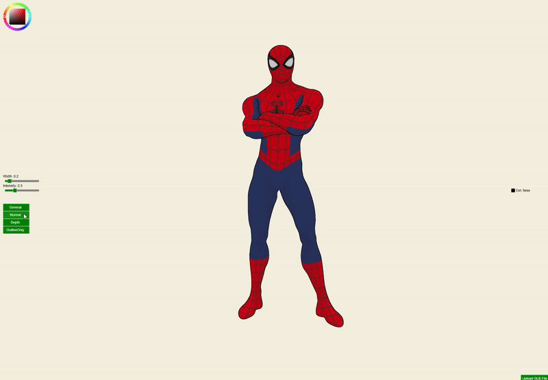
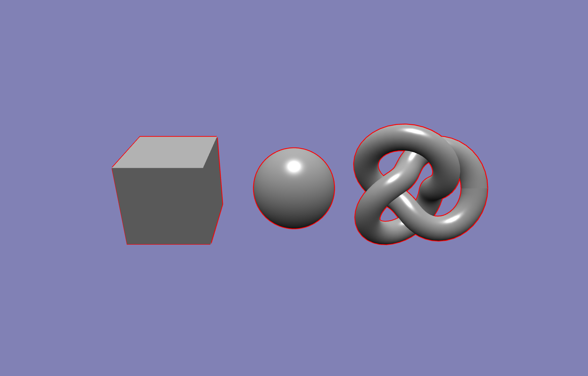
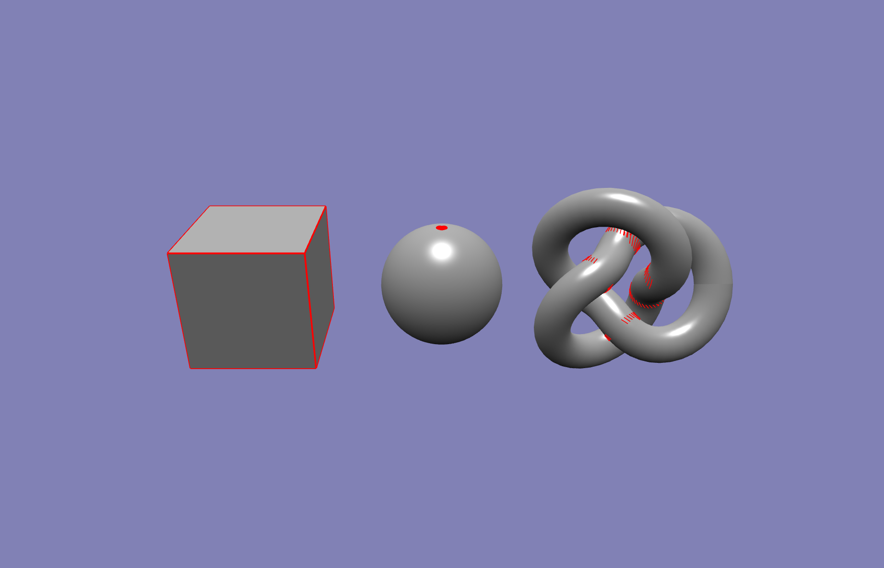
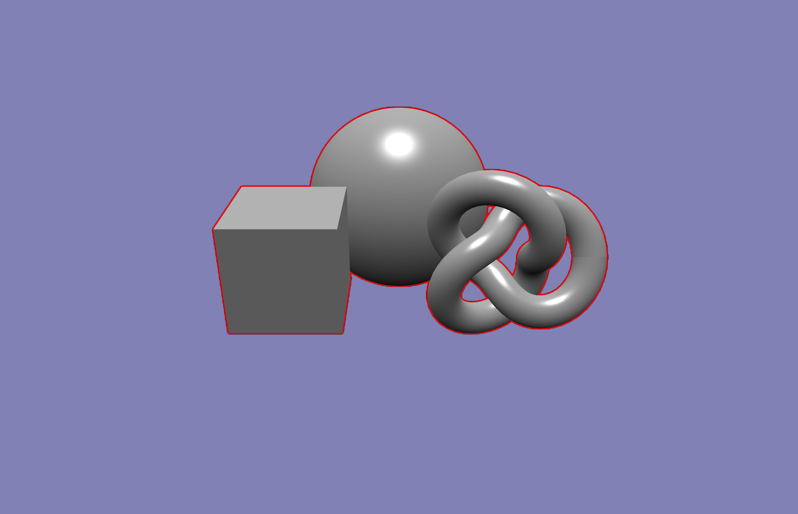
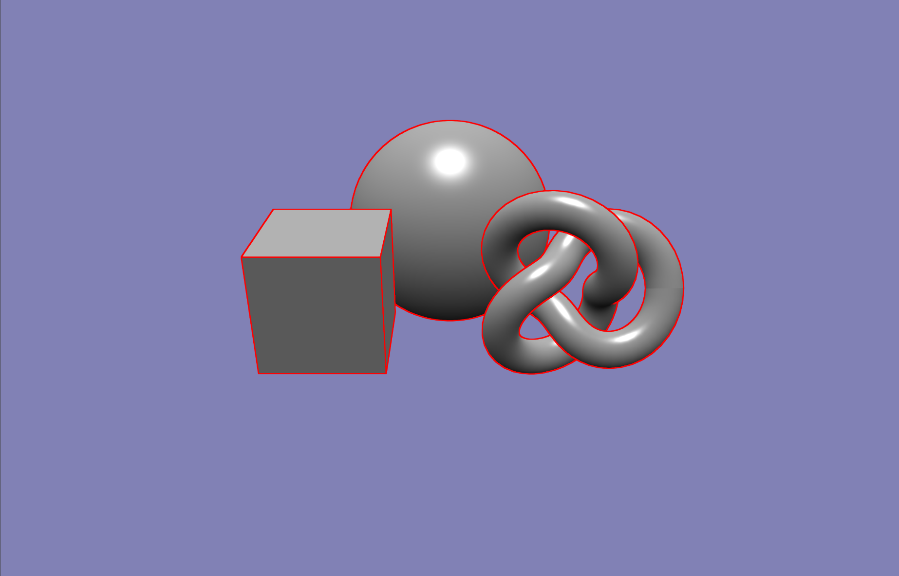
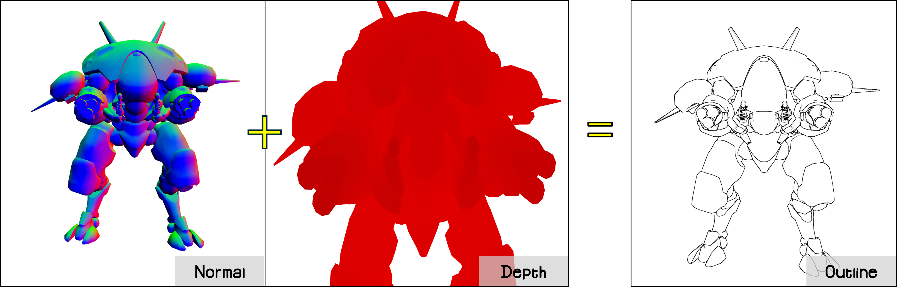

BabylonJS is a powerful 3D engine, but its existing **Outline** had limitations in certain cases. To improve this, I contributed a new version as open-source to version **7.31.1** on **October 29, 2024**. In this post, I will share the motivation behind this contribution, the development process, challenges faced, and lessons learned.



## Motivation

While developing a **Korean webtoon-style rendering tool**, I discovered several issues with BabylonJS's built-in edge detection methods:

### **renderOutline**

- Only detects the **overall contour**
- Adjusting outline thickness causes **gaps**
  

### **edgesRenderer**

- Produces **noise** depending on epsilon value
- Cannot express edges **smoothly** on curved surfaces like spheres
  

### **hightLightLayer**

- Edges are not generated in **overlapping areas**
- Creating a separate layer per mesh causes **performance degradation**
  

Instead of relying on workarounds, I decided to create a **more customizable and high-performance EdgeDetectionPostProcess** from scratch.

- **So I Made This!**
  

## Development Process

### Understanding BabylonJS’s PostProcess System

BabylonJS allows **PostProcess** effects using fragment shaders. I had to structure my shader correctly and integrate it into the rendering pipeline.

### Implementing a New Edge Detection Algorithm

Key implementation steps:

- Applied **Sobel filtering** with optimized sampling
- Added **adjustable parameters** for edge thickness and intensity
- Used **Depth and Normal** for precise detection
  

### Remaining Challenges

- **Noise issues** when applied to large meshes require further improvements
- Since it's a PostProcess, it applies to the entire scene—**a feature to exclude specific meshes is needed**

## Contribution Process

### Creating a Pull Request (PR)

To contribute, I followed these steps:

1. **Forked the BabylonJS repository**
2. Implemented changes in [`PostProcessLibrary`](https://doc.babylonjs.com/toolsAndResources/assetLibraries/postProcessLibrary/edgeDetectionPP/)
3. Maintained **BabylonJS coding standards**
4. Created a **Pull Request (PR)** with a clear explanation of improvements

### Code Review & Feedback

The BabylonJS maintainers provided feedback:

- Additional testing under different rendering conditions
- Requested documentation and a Playground example

After incorporating this feedback, the PR was successfully merged into the **BabylonJS official PostProcess library**.

## Lessons Learned

1. **Aligning with an open-source project’s coding style is crucial**
2. **Clear documentation and demos** speed up PR approval

## How to Use the New EdgeDetectionPostProcess

To apply the new **EdgeDetectionPostProcess**:

```javascript
// edge detection post process
const edgeDetectionPP = new BABYLON.EdgeDetectionPostProcess("Edge PP", scene, 1, camera);
edgeDetectionPP.samples = 4;
// Defines the intensity of the detected edges. Higher values result in more pronounced edges.
edgeDetectionPP.edgeIntensity = 0.3;
// Defines the width of the detected edges. Higher values result in thicker edges.
edgeDetectionPP.edgeWidth = 0.2;
// Defines the color of the detected edges
edgeDetectionPP.edgeColor = new BABYLON.Color3(0, 0, 0);

// This can help anti-aliasing but it can cause performance issues
engine.setHardwareScalingLevel(0.6);
```

For a live demo, check **BabylonJS Playground**: [Demo Link](https://playground.babylonjs.com/#T6IKWW)

## Future Improvements

- **More Sophisticated** Edge Detection for all .glb files
- **Performance optimization**
- Support **Excluding Specific Meshes** from the Post Process

## Conclusion

Contributing to BabylonJS was a **challenging but rewarding experience**. If you’re looking to improve BabylonJS, I highly encourage diving into the source code and submitting your own contributions!
