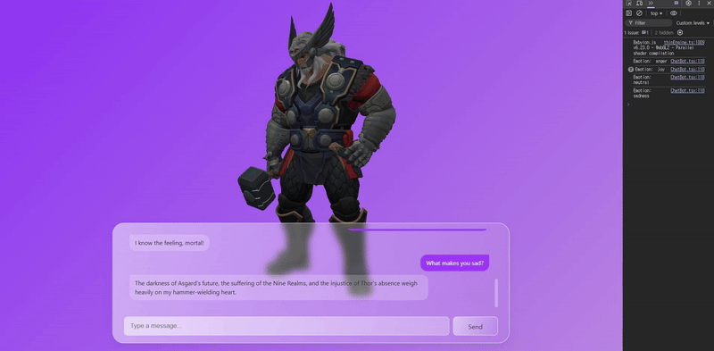
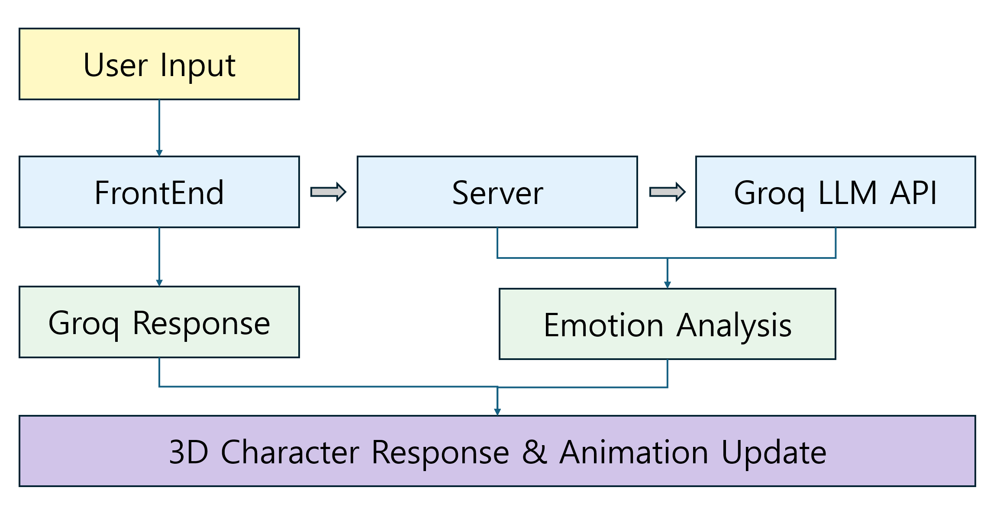

Combining real-time 3D rendering with AI-driven language understanding opens a new door for immersive web interactions. In this post, I’ll walk through how I built a **3D character chatbot** using **BabylonJS** and the **Groq LLM API**, including how I mapped user input to AI responses, analyzed emotional tone, and dynamically linked emotions to 3D character animations.


~~Sad Thor... kinda cute~~

## Motivation

I wanted to go beyond static, text-only chatbots and create something that **feels alive**
— a character that listens, responds, and visually reacts like a real companion.

### Limitations of traditional chat UIs:

- No visual expression of emotion
- Text-only interactions feel flat
- Difficult to build emotional connection

So I created a fully web-based 3D chatbot using BabylonJS for rendering, Groq API for fast language generation, and a custom animation controller based on **emotion analysis**.

## Architecture Overview



## Key Features

### 🔹 Language-Aware Prompting

The chatbot uses a **system prompt** that enforces strict language mirroring:

```json
"You must always respond in the same language as the user's input. Never translate."
```

This allows seamless multilingual conversations — the chatbot automatically responds in Korean or English depending on the input.

### 🔹 JSON-Only AI Replies

The AI returns like this:

```json
{ "reply": "yeah, got it!", "emotion": "neutral" }
```

This structure makes parsing straightforward and separates presentation from logic.

This creates a **visually expressive chatbot** that reacts beyond just speech bubbles.

## Implementation Highlights

### BabylonJS Scene Setup

- Character imported from a `.glb` file and controlled via AnimationGroups

### Connecting to Groq API

A local server receives input, sends it to Groq, then relays the parsed JSON back to the frontend:

```js
const response = await fetch("http://localhost:8080/groq", {
  method: "POST",
  headers: { "Content-Type": "application/json" },
  body: JSON.stringify({
    messages: [
      {
        role: "system",
        content: "You are a friendly character who replies in JSON, matching the user's language.",
      },
      {
        role: "user",
        content: userInput,
      },
    ],
  }),
});
const { reply, emotion } = await response.json();
```

### Real-time Emotion Handling

Once the emotion is parsed, the animation controller updates:

```js
switch (emotion) {
  case "joy":
    playAnimation("Smile");
    break;
  case "anger":
    playAnimation("Frown");
    break;
  case "sadness":
    playAnimation("Sigh");
    break;
  case "surprise":
    playAnimation("Blink");
    break;
  default:
    playAnimation("Idle");
    break;
}
```

## Challenges

- Ensuring **low-latency** Groq responses for real-time interaction
- Working within the **limitations of the free Groq model**, which occasionally affected response quality
- Designing character expressions that match emotional nuance

## Future Plans

- Add **voice synthesis (TTS)** for spoken replies
- Integrate **facial morph targets** for richer emotion expression
- Explore **WebXR support** for immersive AR/VR chatbots

## Demo Viedo

A working demo video here:  
[🎞 Watch the video](https://www.youtube.com/watch?v=NtgHtHV80jI)

## Conclusion

This project was an exciting step toward **emotionally responsive 3D interfaces**. By combining BabylonJS’s power with Groq’s speed, I built a system where conversation feels more natural — visually and emotionally.

If you’re building with BabylonJS and curious about AI integration, I highly recommend experimenting with emotional context and animation. It makes all the difference.
