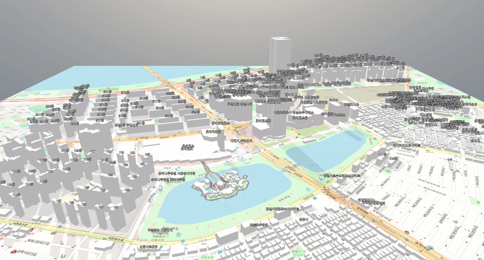

A browser-based **digital twin** doesn’t have to be heavy.

In this post I share how I combined **OpenStreetMap (OSM)** raster tiles, **Overpass API**, and **BabylonJS** to render a city-scale scene where ground textures and **generated building meshes** line up tile-perfectly.

[Check this link](https://unit-digitaltwin.netlify.app)

## Motivation

I wanted something more than a flat map: a scene where **terrain texture** and **built form** appear together, stream in as I navigate, and feel responsive enough for everyday web use.

### Where the usual map → 3D jump struggles

- Texture and world space often drift out of alignment
- Building data arrives late or in big, blocking chunks
- Memory balloons when you pan far and fast

My approach: **OSM tiles on TiledGround** for guaranteed UV alignment, plus **on-demand Overpass queries** to generate buildings inside the current view.

## Architecture Overview

1. **Camera-aware Tile Controller** computes the visible tile set
2. **TiledGround** assigns one material/texture per sub-tile (OSM raster)
3. **Overpass Fetcher** requests only the current bbox for `"building"` features
4. **Mesh Builder** converts footprints to extruded meshes with lightweight materials
5. **Index & Garbage Collector** remove meshes when tiles fall out of range

## Key Features

### 🔹 Tile-Exact Ground

Each **TiledGround sub-mesh = one OSM tile**. UVs and world placement match the Web Mercator grid, so switching styles (road ↔ satellite) is just a texture swap—no remapping.

### 🔹 Streamed Buildings via Overpass

On camera move, I compute the **bbox** for visible tiles and call Overpass for ways/relations tagged `"building"`. Results are turned into footprints (outer rings with holes) and **extruded** to height.

### 🔹 Sensible Height Parsing

Heights come from `height` (meters) when available; otherwise from `building:levels × default_story_height`. A small minimum keeps sheds from disappearing.

### 🔹 Smart Lifecycle

- **addRadius / killRadius** rings around the camera keep only nearby tiles/meshes resident
- A **rate limiter** staggers Overpass calls to avoid bursts
- A **building index** (OSM id → tile key) prevents duplicates and ensures clean deletion

## Implementation Highlights (High-Level)

- **Coordinate plumbing:** lon/lat ⇄ Web Mercator meters, tile XY at zoom _z_, and bbox per tile
- **Textures:** OSM tile URLs bound to sub-materials with clamped addressing to avoid bleeding
- **Footprints:** Consistent winding (outer CCW, holes CW) before extrusion to avoid flipped normals
- **Materials:** Lightweight PBR/Standard with subtle AO-style tint; shadows only for hero shots
- **Housekeeping:** Periodic GC for aged tiles; a soft cap on total meshes

> **Tip:** Be a good API citizen—cache tile images, **throttle Overpass**, and back off on errors.

## Performance Notes

- Keep **tile size in world units** stable; scale camera speed instead of resizing geometry
- Prefer **batched creation** (per tile) over per-building scene mutations
- Use **frustum culling** and **shadow include lists**; disable shadows for distant tiles
- Maintain a **work queue** (fetch → parse → build) so UI stays responsive

## Challenges

- **Latency** spikes from public Overpass instances → mitigated with small bboxes + throttling
- **Footprint hygiene:** mixed relations, self-intersections, or incomplete rings needed fixing
- **Memory discipline:** aggressive off-ramping for tiles just outside the view

## Future Plans

- Switch to **vector tiles** for crisper ground and consistent styling
- Add **morph targets** for roof pitches and façade hints from tags
- Experiment with **server-side caching** of Overpass responses by tile key

## Demo Video

A short walkthrough of panning/zooming and building generation:  
[🎞 Watch the video](https://www.youtube.com/watch?v=WZWz5q_1vfU)

## Conclusion

By aligning **OSM raster tiles** with **TiledGround** and generating buildings from **Overpass** on demand, I achieved a lightweight, **tile-perfect digital twin** that feels immediate in the browser.

If you’re exploring BabylonJS for city-scale scenes, start with reliable **tile alignment**, then layer in **streamed geometry**—the experience jumps from map to _place_ fast.
