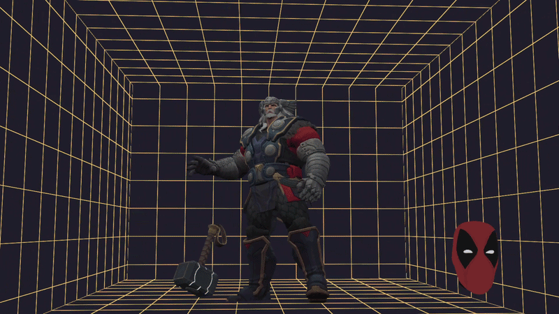
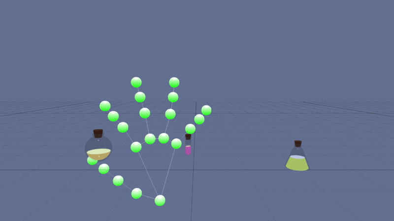
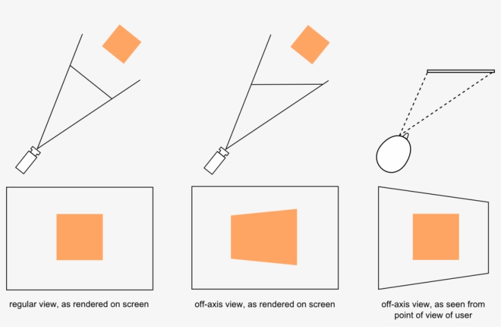

The web is no longer confined to mouse clicks and keyboard events.

By integrating **MediaPipe** with **BabylonJS**, we can create highly immersive experiences that respond to a user's physical presence. In this post, I explore how to implement **off-axis head tracking** and **physics-driven hand interactions** to turn a standard browser window into a reactive 3D space.

### 🎥 Head Tracking (Youtube)

[🎞 Watch the video](https://www.youtube.com/watch?v=NtgHtHV80jI)



### 🎥 Hand Tracking (Youtube)

[🎞 Watch the video](https://www.youtube.com/watch?v=E8WcWEkYpX0)



## Motivation

I wanted to move beyond simple 3D viewing. The goal was to create a "Window into another world" effect where the perspective shifts based on your head position, and you can reach in and manipulate objects with your bare hands—no specialized VR hardware required.

## 1. Head Tracking & 3D Space Control

The core of this feature is creating an **off-axis perspective**. While the 3D scene remains fixed in world space, the camera’s view shifts based on the user's head movement, mimicking the way we look through a physical window.

### 🔹 The "Virtual Mirror" Mask

By mapping a 3D mask to the user's face landmarks, we create a visual anchor. When the user tilts or moves their head, the mask moves in sync, but the real magic is the camera logic.

### 🔹 Off-axis Implementation



Instead of rotating the camera around a center point, we translate the camera relative to the "window" (the screen). As you move left, you see more of the right side of the 3D room, creating a convincing illusion of depth and physical presence.

```javascript
async function initMediaPipe(video, targetCamera) {
  const loadScript = (src) =>
    new Promise((res) => {
      const s = document.createElement("script");
      s.src = src;
      s.onload = res;
      document.head.appendChild(s);
    });

  await loadScript("https://cdn.jsdelivr.net/npm/@mediapipe/camera_utils/camera_utils.js");
  await loadScript("https://cdn.jsdelivr.net/npm/@mediapipe/face_mesh/face_mesh.js");

  const faceMesh = new FaceMesh({
    locateFile: (file) => `https://cdn.jsdelivr.net/npm/@mediapipe/face_mesh/${file}`,
  });

  faceMesh.setOptions({ maxNumFaces: 1, refineLandmarks: true });

  faceMesh.onResults((results) => {
    if (!targetCamera || !results.multiFaceLandmarks?.length) return;

    const nose = results.multiFaceLandmarks[0][4];
    // Logic to update camera position based on nose x, y, z coordinates
  });
}
```

## 2. Hand Tracking & Physics Interaction

Hand tracking allows for natural manipulation of 3D objects. By mapping the hand's skeletal structure, we can detect specific gestures to interact with the environment.

### 🔹 Pinch-to-Grab Logic

The system tracks the distance between the **thumb** and **index finger**.

- **Grab State:** When the distance falls below a certain threshold, the system enters a "grab-ready" state.
- **Attachment:** If the hand is near a grabbable object, the object's physics are temporarily disabled (kinematic mode), and it follows the hand’s position directly.

### 🔹 Physics Release & Liquid Shaders

When the hand opens, the object is released. At this moment, **physics mass** is reapplied, allowing the object to fall naturally under gravity. To enhance realism, objects (like flasks or containers) utilize a **liquid shader** that reacts to the velocity and tilt of the hand movement, making the virtual matter feel "heavy" and real.

[Image of MediaPipe hand landmark mapping]

```javascript
// MediaPipe Hands Setup
async function setupMediaPipeHands(callback) {
  const load = (src) =>
    new Promise((r) => {
      const s = document.createElement("script");
      s.src = src;
      s.onload = r;
      document.head.appendChild(s);
    });

  if (typeof Hands === "undefined") {
    await load("https://cdn.jsdelivr.net/npm/@mediapipe/camera_utils/camera_utils.js");
    await load("https://cdn.jsdelivr.net/npm/@mediapipe/hands/hands.js");
  }

  const h = new Hands({
    locateFile: (f) => `https://cdn.jsdelivr.net/npm/@mediapipe/hands/${f}`,
  });

  h.setOptions({
    maxNumHands: 1,
    modelComplexity: 0,
    minDetectionConfidence: 0.5,
    minTrackingConfidence: 0.5,
  });

  h.onResults(callback);
  return h;
}
```

## Key Technical Challenges

- **Coordinate Mapping:** Translating 2D video coordinates from MediaPipe into 3D world units in BabylonJS requires careful FOV matching.
- **Latency vs. Smoothing:** Raw tracking data can be jittery. I implemented a **OneEuroFilter** to smooth movements without introducing significant lag.
- **Physics Stability:** Rapid hand movements can cause objects to "fly" through walls. Implementing continuous collision detection (CCD) is vital for these high-speed interactions.

## Conclusion

By combining the spatial awareness of **MediaPipe** with the robust physics engine of **BabylonJS**, we can create web experiences that feel tangible. This setup isn't just for games; it's a foundation for the next generation of web-based digital twins, interactive educational tools, and accessible UI.

If you're building this, remember: **Performance is UX**. Keep your MediaPipe models lightweight and your physics geometry simple for the best browser experience.
