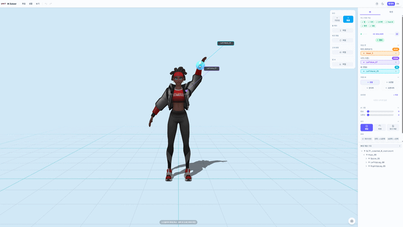
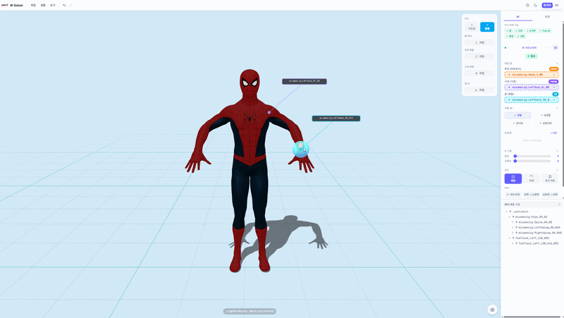

[🎞 Watch the video](https://www.youtube.com/watch?v=iJHrqaaXhjE)

Posing a 3D character usually means opening a DCC tool, building an IK rig, and wiring up constraints before you can touch a single joint.

**IK Solver** removes that step. Drop a `.glb` into the browser, and it detects the arms, legs, head and hands automatically, then lets you drag an end effector while the solver keeps the chain physically plausible. No rig authoring, no plugin, no install — just a URL. This post walks through the core of how it works: an **analytical IK solver** that runs entirely in **skeleton-local space**, and the rig-agnostic detection that makes it work on skeletons it has never seen.

Built with **Babylon.js 9** for the 3D layer and **Next.js 16 / React 19** for the shell.

### 🎥 Drag-to-pose IK



### 🎥 Live symmetry



## Motivation

I wanted the shortest possible path from "here is a character" to "here is a pose." Every existing tool assumes you own the rig and are willing to configure it. But most useful GLBs in the wild — Mixamo exports, Unreal Marketplace characters, Blender Rigify dumps, VRoid avatars — arrive with wildly inconsistent skeletons and no IK setup at all.

The goal was a poser that treats the skeleton as a black box: point it at any humanoid rig, and it figures out the rest.

## 1. The Solver — Analytical 2-Bone IK, CCD for the rest

The heart of the tool is a solver that turns "the hand should be _here_" into joint rotations. There are two paths.

### 🔹 Analytical 2-bone IK

An arm or leg is a three-bone chain (shoulder → elbow → wrist). For exactly this case, iterative solvers are overkill and introduce pole ambiguity — the elbow can flip to the wrong side. Instead we solve it in closed form with the **law of cosines**: the reach distance and the two segment lengths fully determine the elbow angle, and a pole target fixes which side it bends toward.

```javascript
// Law of cosines — angle at root from the root→target direction
const cosAlpha = Math.max(-1, Math.min(1, (L1 * L1 + d * d - L2 * L2) / (2 * L1 * d)));
const alpha = Math.acos(cosAlpha);

// Desired knee/elbow position in skeleton space.
// sin(alpha) > 0 always, so the joint is always on the pole side.
const kneeTarget = rootPos.add(rootToTargetDir.scale(L1 * Math.cos(alpha))).add(perpDir.scale(L1 * Math.sin(alpha)));
```

One evaluation, no iteration, and the bend side is guaranteed. Two direct rotations place the root toward the computed knee and the mid-bone toward the target.

### 🔹 CCD for longer chains

Spines, tails and finger chains have more than three joints, so there is no analytical answer. For those we fall back to **Cyclic Coordinate Descent** — walk the chain from the end effector back to the root, rotating each joint to point the tip at the target, and iterate. A per-step angle clamp keeps it from snapping, and an optional pole plane projects every rotation into the IK plane so the chain doesn't corkscrew.

## 2. The Hard Part — Skeleton-Local Space

Here is the detail that shaped the entire codebase. **GLB rigs carry a skeleton-to-world matrix that is rotated _and_ mirrored** — it has a negative determinant. glTF's coordinate conventions bake an axis flip into the skeleton.

The naïve approach — read a bone's world position, do vector math, write it back — breaks the moment you introduce that mirror. A rotation computed in world space, applied through a mirrored transform, comes out flipped. Feet twist inward, mirrored poses reflect the wrong way, foot tilt inverts.

So the entire solver works in **skeleton-local space** (determinant +1, no flip) and only crosses into world space at the boundary — for raycasting against the floor, for example:

```javascript
// Convert world targets into skeleton space before solving...
const targetSkel = Vector3.TransformCoordinates(targetAnkleWorld, worldToSkel);

// ...solve entirely in that space...
solveCCD(leg.chain, targetSkel, skeleton, 15, 0.003, 0.4, poleSkel);

// ...and convert the surface normal in too, never applying a world tilt locally.
const normalLocal = Vector3.TransformNormal(sample.normal, worldToSkel).normalize();
```

### 🔹 The GPU dirty-flag trap

A second subtle one: writing a bone's rotation with the obvious `setRotationQuaternion(LOCAL)` **silently fails to deform the mesh**. That setter copies the quaternion in a way that bypasses the dirty flag, so `skeleton.prepare()` skips the GPU skin-matrix rebuild during render. The bone moves in the data model, but the visible mesh never updates.

The fix is to write through `bone.updateMatrix(mat, false)`, which forces `skeleton._isDirty = true`. Every write in the solver goes through this path.

## 3. Rig-Agnostic Detection

For the tool to work with zero setup, it has to _find_ the arms, legs, and left/right pairs in a skeleton whose bones could be named anything.

### 🔹 Side detection across conventions

Left/right is encoded a dozen different ways in the wild. The detector recognizes all of them:

```javascript
//   • Mixamo / Unreal words ............ "LeftArm", "arm_l", "Arm Left"
//   • Blender / Rigify dot-suffix ...... "upper_arm.L", "hand.R.001"
//   • 3ds Max biped spaced letter ...... "Bip01 L UpperArm"
//   • DAZ lowercase prefix ............. "lShldr", "rForeArm"
//   • Trailing camel letter ............ "ArmL", "HandR"
//   • CJK markers (MMD / VRoid) ........ "左腕", "右腕"
```

To pair a bone with its mirror counterpart we compute a **side-stripped "core" key** — remove the side token _and_ the per-node index numbers exporters bake in (`LeftArm_41_08` ↔ `RightArm_80_027` both reduce to `arm`), while keeping digits glued to a word so `Thumb1` and `Spine2` stay distinct.

### 🔹 Geometric mirroring, not quaternion sign-flips

Because the bind pose isn't guaranteed symmetric, we don't mirror by flipping quaternion signs (the usual trick — rig-dependent and fragile). Instead we reflect the _motion from rest_ geometrically across the sagittal plane:

```javascript
// Reflect an absolute orientation across the plane with unit normal `n`.
function reflectQuat(q, n) {
  const d = q.x * n.x + q.y * n.y + q.z * n.z;
  return new Quaternion(2 * d * n.x - q.x, 2 * d * n.y - q.y, 2 * d * n.z - q.z, q.w).normalize();
}
```

The sagittal plane normal itself is _derived_, not assumed — averaged from the (right − left) displacement of every detected bone pair. This same plan powers **live symmetry**: edit one arm and the other mirrors every frame.

## 4. Foot IK — AAA-Style Slope Placement

Beyond limb dragging, the tool plants feet on a draggable ramp. Each frame, every foot raycasts down against the slope; if it's over the surface, leg IK pulls the ankle to it and the foot pitches to lie flat along the incline.

The tricky measurement is _where the sole actually is_. Bones sit **inside** the shoe mesh, typically a few centimeters above the real sole — so trusting the toe bone makes the shoe sink into the ground. The solver takes the **deepest** of three estimates (mesh bounding box, a multi-point upward raycast across the sole, and the lowest descendant bone) to guarantee the shoe rests on the surface instead of clipping through it.

## Key Technical Challenges

- **The mirrored skeleton matrix.** Every piece of bone math had to live in skeleton-local space; world-space shortcuts silently produce flipped results on GLB rigs.
- **Silent GPU skinning failures.** `setRotationQuaternion` updates the model but not the mesh. All writes route through `updateMatrix` to trip the dirty flag.
- **Pole ambiguity.** Analytical 2-bone IK with an explicit pole side eliminates the elbow/knee flip that plagues generic CCD.
- **Naming chaos.** Convention-agnostic side detection and index-stripped core keys let one algorithm pose Mixamo, Unreal, Blender, DAZ and MMD rigs alike.
- **Non-ASCII build path.** Turbopack panics on the Korean characters in the project path, so correctness is verified with `tsc` + `eslint` rather than a full `next build`.

## Conclusion

By keeping the solver **analytical where it can be**, **local where it must be**, and **agnostic about naming**, IK Solver turns any humanoid GLB into something you can pose with a mouse in seconds — no rig, no plugin, no install.

The same principles generalize well beyond posing: browser-native character tooling, previz, reference building for artists, and accessible 3D content creation. If you're building something similar, the one lesson worth carrying out: **respect the coordinate space your rig actually lives in.** On the web, that space is almost never the one you assumed.

---

**Stack:** Next.js 16 · React 19 · Babylon.js 9 · Zustand · Tailwind CSS 4
